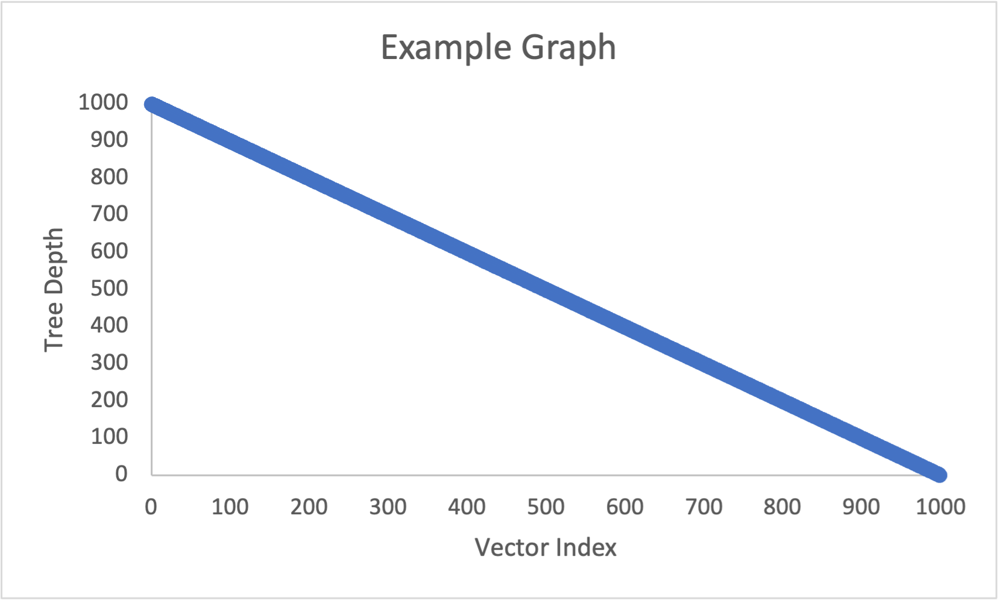

# Project 3 Report

Answer the following questions directly in this file:
* You will have a different grader again, so make sure your report includes information about your dataset.
* 
* My dataset is about climate change's impact on agriculture.
* It has: Year, Country, Region, Crop type, Average temperature celsius, Total precipitation in mm, CO2 emissions in metric tons
* Crop yield in metric tons per hectacre, Extreme weather events, Irrigation access percent, Pesticide use in kg per hectacre
* Fertilizer use in kg per hectacre, Soil health index, Adaptation Strategies, Economic impact in millions USD
* 
* How do the depths of the random-ordered integers compare to the depths of the ordered integers for each tree? Why?
*
* The binary search tree for random-ordered integers is much shorter than in order, this would be because there is a more balanced tree
* due to the random insertion. When it is in order, each integer adds a new node.
* The AVL tree maintains a similar length regardless of in order or randomized integers. The major difference between the two is that
* the in order integers have a pattern to depth (i.e. 23456123456) whereas the randomized ones do not have a clear pattern of depth.
* This would be because the AVL tree rotates to maintain the depth, so regardless of the order it will balance itself and keep the depth similar.
* The splay tree starts out with high depths for the low numbers, but get lower as the values get high for the in order. For the randomized
* list, there are more in the middle depth values but no super high ones like 99 that the in order list has. This is because the splay tree
* adjusts depending on what is inserted, so the structure can vary greatly depending on the order of the values.
* 
* How do the depths of each custom-data-type tree compare to each other?
* 
* The binary search tree starts out low and the depth goes up as the ID values go up in a consistent manner. The AVL tree consistently has depth values
* of 7-12 for most of the ID values, and is more randomly distributed as far as depth. The splay tree starts out with very high depth values and quickly
* drops off to values like 1, 2, 3 as ID values go up. The second splay tree, however, goes x high number then 0, 0, 0, 0. 
* 
* Why do the depths of the second custom-data-type Splay Tree make sense?
* 
* This is because the initial accessing of that node in the splay tree brings it to the top for easy future access, so it is already at a low (0) depth for subsequent calls.
* 
* Graph the Binary Search Tree, AVL Tree, and Splay Tree depths for the custom data type trees. Do not use C++ to graph, you can use whatever spreadsheet application or graphical programming language you prefer. You can use whatever graph is most readable to you (e.g. scatter plot, histogram, etc.).
  * Your graphs should have clear labels for both x and y axes.
  * Save your graph files in the graphs folder.
  * You do not need to graph the depths of the integer type trees or the Splay Tree that finds each object 5 times in a row, but you can if you feel it helps you analyze the data.
  * An example graph spreadsheet and an example graph image have been included in the starter code.
  * Here is how you include an image in your Report.md file: 
* Compare and contrast the graphs and explain the differences based on what you know about the structure and behavior of the trees. Justify the time complexity of searching the trees based on the results.

**Note: Any code that was not authored by yourself or the instructor must be cited in your report. This includes the use of concepts not taught in lecture.**
* I have been referring to Starting Out With C++ eighth edition, so there may be concepts not taught in class.